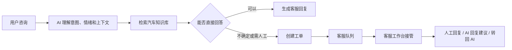

# 汽车智能客服

## 1. 标题 + 一句话描述

### 汽车智能客服

一句话描述：帮汽车品牌客服团队把高频咨询自动回答、复杂问题精准转人工的 Web 客服工作台。

## 2. 背景 / 问题

汽车客服场景里，大量咨询集中在车型、价格、保养、维修、政策和预约等高频问题上，人工客服容易被重复问题占满。

传统关键词机器人很难理解上下文、情绪和模糊表达，遇到复杂问题时也缺少顺滑的转人工链路。

这个项目希望把“AI 先接待、必要时转人工、客服可继续协作处理”做成一个可演示的完整闭环。

## 3. 解决方案

用户在聊天页输入问题或点击快捷问法后，系统先识别意图、情绪和上下文，再结合汽车知识库生成回答。
如果问题连续无法解决、用户情绪偏负面或需要人工确认，系统会自动创建工单并进入客服队列。客服可以查看对话历史、接管回复，也可以使用 AI 生成的回复建议，处理完成后关闭工单或转回 AI。



## 4. 核心功能

- 用户可以在聊天页完成汽车咨询，系统会结合上下文给出更连贯的回答。
- 系统会识别模糊问题、负面情绪和高风险场景，并自动触发转人工工单。
- 客服可以在工作台查看排队工单、历史对话和用户上下文，减少重复询问。
- 客服处理过程中可生成 AI 回复建议，提升人工接待效率。
- 管理侧支持维护 Markdown 知识文档，为车型、价格、保养、维修和政策问答提供知识来源。

## 5. 技术栈 / 架构亮点

**技术栈：** React 19 / TypeScript / Vite / FastAPI / SQLite / Chroma / OpenAI-compatible LLM API / WebSocket / pytest / ruff。

**架构亮点：**

- 前后端职责清晰：前端负责聊天、队列、客服工作台和知识库管理，后端负责任务编排、工单状态、知识检索和模型调用。
- 采用 Mock-first 到真实 API 的开发路径，先跑通交互体验，再逐步替换为后端真实链路，降低端到端集成风险。
- 将 AI 对话拆成意图识别、情绪判断、知识检索、回复生成和转人工决策，便于调试和后续扩展。
- 知识库基于 Markdown 文档构建，结合向量检索、关键词检索和重排思路，支持从结构化汽车资料中召回答案依据。
- 工单流转保留对话历史、客服动作和 bad case 标记，为后续质检、回放和评测沉淀数据基础。

## 6. 数据 / 成果

当前项目是本地可运行 Demo，已经跑通“用户咨询 -> AI 回复 -> 自动转人工 -> 客服接管 -> AI 回复建议 -> 转回 AI / 关闭工单”的核心链路。

E1 回归已验证 3 个关键场景：预算购车咨询与试驾预约、连续模糊问题自动建单、负面情绪触发高优先级工单并由客服处理。

E2 启动回归已验证后端健康检查、前端访问和首条真实聊天消息。后端检索与知识切分相关测试已通过。

真实线上用户、访问量、业务转化和客服效率数据：待补充。

## 7. Demo 链接 + GitHub 链接

- Demo：待补充；当前为本地 Demo，启动后访问 `http://localhost:5175/chat`
- GitHub：待补充
- Quick Start：

```bash
# Backend
cd /Users/pompeiichan/Desktop/car_customer_service/Projects_Repo/auto-cs
.venv/bin/python run.py

# Frontend
cd /Users/pompeiichan/Desktop/car_customer_service/Projects_Repo/auto-cs/frontend
VITE_USE_MOCK=false \
VITE_API_BASE_URL=/api \
VITE_BACKEND_PROXY_TARGET=http://localhost:8199 \
npm run dev -- --host 127.0.0.1 --port 5175 --strictPort
```

## 8. 下一步 / Roadmap

- 补充 Demo 截图、录屏和公开访问地址，让作品集展示更直观。
- 增加一组稳定的客服场景评测集，用于回归验证意图识别、知识召回和转人工判断。
- 完善知识库来源标注和更新流程，避免过期车型、价格或政策信息被直接承诺给用户。
- 增加客服质检看板，把 bad case、人工接管原因和 AI 建议采纳情况沉淀为可分析数据。
