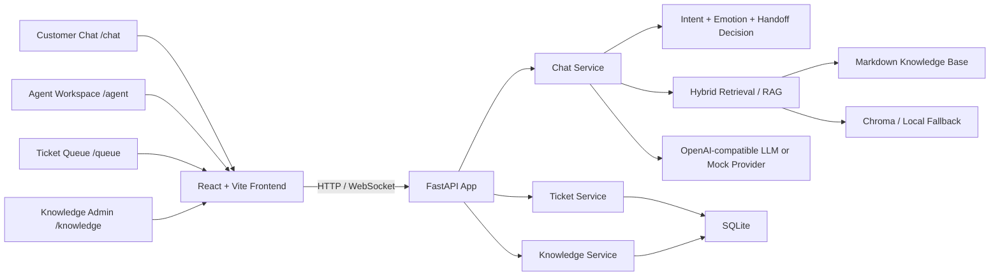

# Auto CS: Intelligent Automotive Customer Service

English | [简体中文](README.md)


An AI customer-service workspace for automotive brands. It answers high-frequency questions about models, pricing, maintenance, repairs, and policies, escalates risky or uncertain conversations to human agents, and gives support agents the context and AI suggestions they need to resolve tickets faster.

> This is a full-stack local demo focused on an end-to-end customer-service workflow: AI reception, knowledge retrieval, human handoff, ticket queue, and agent collaboration.

## Contents

- [Highlights](#highlights)
- [Product Capabilities](#product-capabilities)
- [Architecture](#architecture)
- [Quick Start](#quick-start)
- [Routes](#routes)
- [API Smoke Test](#api-smoke-test)
- [Quality Checks](#quality-checks)
- [Knowledge Base](#knowledge-base)
- [Project Structure](#project-structure)
- [Roadmap](#roadmap)

## Highlights

- **AI + human handoff**: AI handles the first response and escalates ambiguous, negative, risky, or confirmation-heavy conversations to human agents.
- **RAG-first knowledge flow**: Markdown knowledge files provide traceable answers for vehicle specs, pricing, maintenance, repairs, policies, and safety boundaries.
- **Agent workspace**: Agents can claim tickets, inspect conversation context, send manual replies, generate AI suggestions, resolve tickets, or transfer conversations back to AI.
- **Realtime experience**: WebSocket-powered streaming replies and handoff notifications connect customer chat with the agent workspace.
- **Mock-friendly local demo**: The app can run without LLM, embedding, or rerank credentials by falling back to local mock behavior.

## Product Capabilities

| Module | Description |
| --- | --- |
| Customer chat | Quick actions, natural-language input, streaming replies, and session context |
| Intelligent response | Intent, emotion, round tracking, handoff decision, and knowledge-grounded answers |
| Human escalation | Ticket creation for complex, ambiguous, negative, or high-risk cases |
| Ticket queue | Filter and sort tickets by status, category, emotion, and wait time |
| Agent workspace | Claim tickets, review history, reply manually, generate AI suggestions, resolve or transfer back to AI |
| Knowledge admin | Upload Markdown documents and inspect indexing status for RAG retrieval |

## Architecture



## Quick Start

### Requirements

- Python 3.11+
- Node.js 18+
- npm

### 1. Enter the project

```bash
git clone https://github.com/PompeiiChan/DEMO_CarIntelligentCustomerService.git
cd DEMO_CarIntelligentCustomerService
```

### 2. Install backend dependencies

```bash
python3 -m venv .venv
.venv/bin/python -m pip install --upgrade pip
.venv/bin/python -m pip install -e ".[dev]"
```

### 3. Install frontend dependencies

```bash
cd frontend
npm install
cd ..
```

### 4. Configure environment variables

```bash
cp .env.example .env
```

For a local-only demo, leave the keys empty and the app will use mock/fallback behavior:

```dotenv
LLM_API_KEY=
EMBEDDING_API_KEY=
RERANK_API_KEY=
```

Do not leave placeholder values such as `sk-your-siliconflow-key-here`; they will be treated as real credentials and used for remote API calls.

### 5. Start the backend

```bash
.venv/bin/python run.py
```

Default backend URL:

```text
http://localhost:8199
```

### 6. Start the frontend

Open another terminal:

```bash
cd frontend
VITE_USE_MOCK=false \
VITE_API_BASE_URL=/api \
VITE_BACKEND_PROXY_TARGET=http://localhost:8199 \
npm run dev -- --host 127.0.0.1 --port 5175 --strictPort
```

Open:

```text
http://localhost:5175/chat
```

## Routes

| Path | Page |
| --- | --- |
| `/chat` | Customer chat |
| `/queue` | Support ticket queue |
| `/agent` | Agent workspace |
| `/knowledge` | Knowledge-base admin |

## API Smoke Test

Health check:

```bash
curl http://localhost:8199/health
```

Expected response:

```json
{"status":"ok","version":"1.0.0"}
```

Send a chat message:

```bash
curl -X POST http://localhost:8199/api/v1/chat/message \
  -H "Content-Type: application/json" \
  -d '{"session_id":"startup-check","message":"I am looking for a car around 200k RMB"}'
```

The response includes fields such as `reply`, `intent`, `emotion`, `need_human`, and `round`.

## Quality Checks

Backend tests:

```bash
.venv/bin/python -m pytest
```

Frontend build:

```bash
cd frontend
npm run build
```

Frontend lint:

```bash
cd frontend
npm run lint
```

## Knowledge Base

`knowledge-base/` is the primary source for customer-service answers. It currently covers:

- Vehicle specs and comparisons
- Pricing, financing, subsidies, and purchase flow
- Maintenance, charging, app usage, and daily operation
- Repairs, roadside assistance, and common troubleshooting
- Policies, warranties, recalls, OTA, and license-plate guidance
- Pre-sales, in-sales, and after-sales question libraries
- Human handoff rules, agent summary fields, and de-escalation phrases
- Non-commitment rules and safety boundaries

Pricing, incentives, subsidies, recalls, warranty details, and other time-sensitive information should be treated as references only. Final commitments should be confirmed through the official app, official website, store, or human support.

## Project Structure

```text
auto-cs/
├── app/                    # FastAPI routers
├── pycore/                 # Settings, DB, LLM, retrieval, ticket, and chat services
├── frontend/               # React/Vite frontend
├── knowledge-base/         # Markdown automotive support knowledge base
├── docs/                   # PRD, API contracts, startup guide, and prototypes
├── tests/                  # Backend tests
├── scripts/                # Utility scripts such as knowledge upload
├── run.py                  # Backend entrypoint
├── pyproject.toml          # Python dependencies and tooling
└── .env.example            # Local environment template
```

## Roadmap

- Add a stable customer-service evaluation set for intent detection, retrieval quality, and handoff decisions.
- Expand QA analytics for bad cases, escalation reasons, and AI suggestion adoption.
- Add public demo screenshots and deployment notes for portfolio presentation.
- Improve source tracking and refresh workflows for dynamic pricing, benefits, and policy documents.

## More Docs

- [Startup and validation guide](docs/startup.md)
- [Product one-pager](PRODUCT_ONE_PAGE.md)
- [Product requirements](docs/PRD.md)
- [API contracts](docs/api-contracts.md)
- [Development plan](docs/Plan.md)
