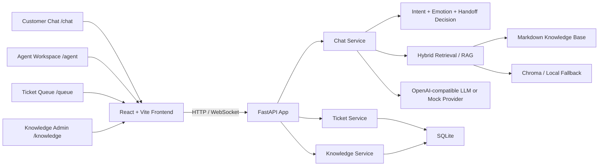
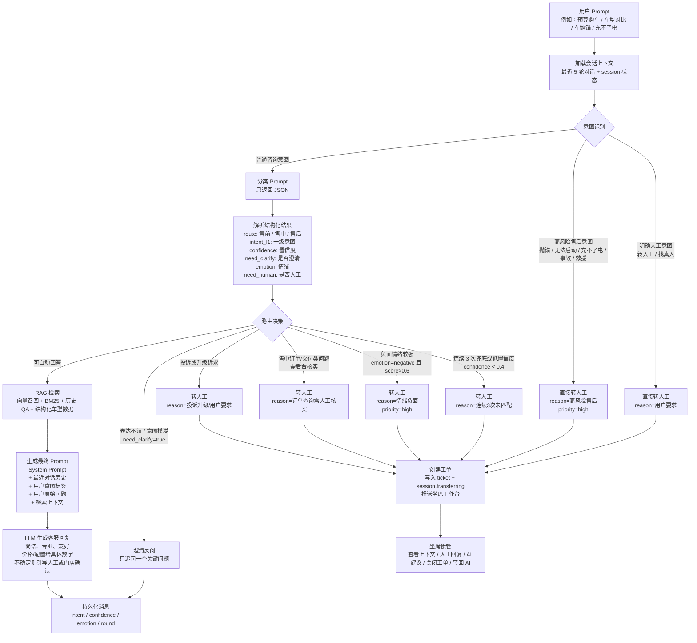

# 汽车智能客服 Auto CS

[English](README.en.md) | 简体中文


面向汽车品牌客服团队的 AI 客服工作台：用自然语言回答车型、价格、保养、维修、政策等高频问题，在高风险、负面情绪或无法确认的场景自动转人工，并为坐席提供对话历史、工单队列和 AI 回复建议。

> 这是一个本地可运行的全栈 Demo，重点展示 AI 客服链路、知识库检索、人工接管和坐席协作工作台，而不是只停留在聊天窗口。

## 目录

- [核心亮点](#核心亮点)
- [产品能力](#产品能力)
- [技术架构](#技术架构)
- [Prompt 流转](#prompt-流转)
- [快速启动](#快速启动)
- [页面入口](#页面入口)
- [API 验证](#api-验证)
- [测试与质量检查](#测试与质量检查)
- [知识库](#知识库)
- [项目结构](#项目结构)
- [Roadmap](#roadmap)

## 核心亮点

- **AI + Human handoff**：AI 优先接待，遇到连续模糊、强负面情绪、高风险售后或需人工确认的问题时自动建单。
- **RAG-first knowledge flow**：围绕 Markdown 知识库组织车型、价格、保养、维修、政策和安全边界，用于可追溯回答。
- **Agent workspace**：坐席可接单、查看上下文、发送人工回复、生成 AI 建议、关闭工单或转回 AI。
- **Realtime experience**：客户端聊天与坐席侧消息推送使用 WebSocket，支持流式回复与接管通知。
- **Mock-friendly local demo**：没有 LLM / Embedding / Rerank Key 时自动降级，仍可完成本地演示和基础验收。

## 产品能力

| 模块 | 说明 |
| --- | --- |
| 客户端聊天 | 支持快捷问法、自然语言输入、WebSocket 流式回复和上下文会话 |
| 智能回复 | 识别意图、情绪、轮次和转人工条件，结合知识库生成回答 |
| 自动转人工 | 对复杂、模糊、负面、高风险问题创建工单并进入客服队列 |
| 工单队列 | 按状态、分类、情绪和等待时长查看待处理工单 |
| 坐席工作台 | 接单、查看历史对话、人工回复、AI 建议回复、关闭工单、转回 AI |
| 知识库管理 | 上传 Markdown 文档，查看处理状态，支撑客服 RAG 检索 |

## 技术架构



## Prompt 流转

用户输入不会直接丢给大模型生成答案，而是先经过一层客服路由 Pipeline。系统会先进入意图识别层，识别用户是否明确要人工、是否属于高风险售后、业务路由、一级意图、置信度、澄清需求和情绪，最后根据结果选择“澄清反问、RAG 回答、转人工”中的一种路径。



核心分流规则：

| 分支 | 触发条件 | 系统动作 |
| --- | --- | --- |
| 澄清反问 | 用户表达太模糊，分类结果 `need_clarify=true` | 不急着回答，只问一个关键澄清问题 |
| 自动回答 | 意图明确、风险可控、知识库可支撑 | 检索知识库并把上下文拼入最终 Prompt |
| 用户要求人工 | 用户明确说“转人工”“找真人”等 | 跳过生成回答，直接建单 |
| 高风险售后 | 抛锚、无法启动、充不了电、事故、救援等 | 直接建高优先级工单 |
| 情绪负面 | 负面情绪概率高于阈值 | 转人工，并提高优先级 |
| 连续未匹配 | 多轮低置信度或兜底澄清 | 转人工，避免 AI 反复追问 |
| 售中核实 | 订单、交付、付款等需要后台确认 | 转人工，由坐席核实 |

## 快速启动

### 环境要求

- Python 3.11+
- Node.js 18+
- npm

### 1. 进入项目目录

```bash
git clone https://github.com/PompeiiChan/DEMO_CarIntelligentCustomerService.git
cd DEMO_CarIntelligentCustomerService
```

### 2. 安装后端依赖

```bash
python3 -m venv .venv
.venv/bin/python -m pip install --upgrade pip
.venv/bin/python -m pip install -e ".[dev]"
```

### 3. 安装前端依赖

```bash
cd frontend
npm install
cd ..
```

### 4. 配置环境变量

```bash
cp .env.example .env
```

本地演示可以把 Key 留空，系统会使用 Mock / 降级链路：

```dotenv
LLM_API_KEY=
EMBEDDING_API_KEY=
RERANK_API_KEY=
```

不要保留 `sk-your-siliconflow-key-here` 这类占位字符串；程序会把它当作真实 Key 尝试请求远端接口。

### 5. 启动后端

```bash
.venv/bin/python run.py
```

默认后端地址：

```text
http://localhost:8199
```

### 6. 启动前端

另开一个终端：

```bash
cd frontend
VITE_USE_MOCK=false \
VITE_API_BASE_URL=/api \
VITE_BACKEND_PROXY_TARGET=http://localhost:8199 \
npm run dev -- --host 127.0.0.1 --port 5175 --strictPort
```

访问：

```text
http://localhost:5175/chat
```

## 页面入口

| 路径 | 页面 |
| --- | --- |
| `/chat` | 客户咨询聊天页 |
| `/queue` | 客服工单队列 |
| `/agent` | 坐席处理工作台 |
| `/knowledge` | 知识库管理页 |

## API 验证

健康检查：

```bash
curl http://localhost:8199/health
```

预期返回：

```json
{"status":"ok","version":"1.0.0"}
```

发送一条聊天消息：

```bash
curl -X POST http://localhost:8199/api/v1/chat/message \
  -H "Content-Type: application/json" \
  -d '{"session_id":"startup-check","message":"我想买一辆20万左右的车"}'
```

返回内容会包含 `reply`、`intent`、`emotion`、`need_human`、`round` 等字段。

## 测试与质量检查

后端测试：

```bash
.venv/bin/python -m pytest
```

前端构建：

```bash
cd frontend
npm run build
```

前端 lint：

```bash
cd frontend
npm run lint
```

## 知识库

`knowledge-base/` 是客服回答的重要知识来源，当前覆盖：

- 车型规格与车型对比
- 价格、金融、补贴和购车流程
- 保养、充电、App 使用和日常注意事项
- 维修、道路救援和常见故障自查
- 政策、质保、召回、OTA 和上牌
- 售前、售中、售后问法库
- 转人工规则、客服摘要字段和安抚话术
- 不可承诺事项与安全边界

涉及价格、权益、补贴、召回、质保等高时效信息时，自动回答只能作为参考，最终应以官方 App、官网、门店或人工客服确认结果为准。

## 项目结构

```text
auto-cs/
├── app/                    # FastAPI 路由入口
├── pycore/                 # 配置、数据库、LLM、检索、工单和聊天服务
├── frontend/               # React/Vite 前端
├── knowledge-base/         # Markdown 汽车客服知识库
├── docs/                   # PRD、API 契约、启动文档和原型
├── tests/                  # 后端测试
├── scripts/                # 知识库导入等辅助脚本
├── run.py                  # 后端启动脚本
├── pyproject.toml          # Python 依赖与工具配置
└── .env.example            # 本地环境变量示例
```

## Roadmap

- 增加一组稳定的客服场景评测集，持续回归意图识别、知识召回和转人工判断。
- 扩展客服质检看板，分析 bad case、人工接管原因和 AI 建议采纳情况。
- 补充公开 Demo 截图与部署说明，方便作品集展示和远程体验。
- 强化知识库来源标注和更新流程，降低动态价格、权益、政策信息过期风险。

## 更多文档

- [启动与验收细节](docs/startup.md)
- [产品概览](PRODUCT_ONE_PAGE.md)
- [产品需求](docs/PRD.md)
- [API 契约](docs/api-contracts.md)
- [开发计划](docs/Plan.md)
